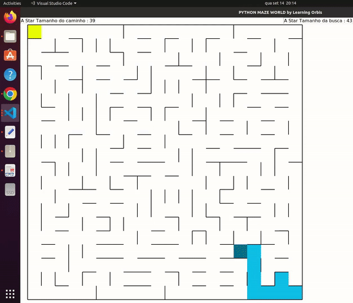
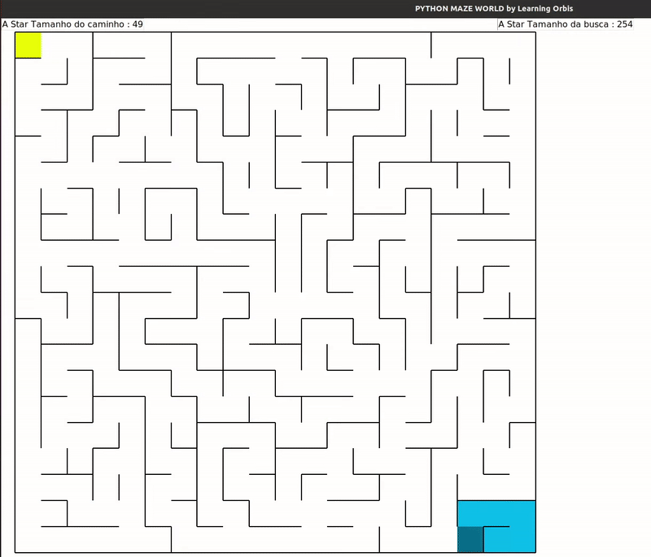
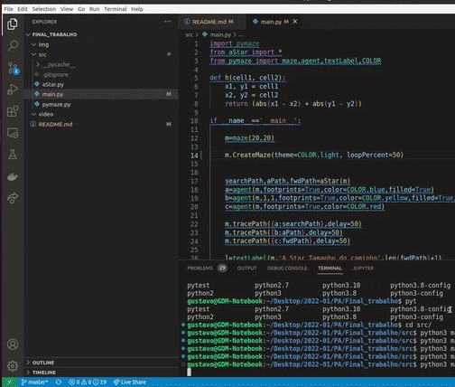

# Final_AStarMaze

**Número da Lista**: N/A<br>
**Conteúdo da Disciplina**: Trabalho Final DFS e AStar<br>

## Alunos
|Matrícula | Aluno |
| -- | -- |
| 19/0027088 |  Eliás Yousef Santana Ali |
| 20/0038141  | Gustavo Duarte Moreira |

## Sobre 
O projeto consiste na criação de um labirinto utilizando a técnica de busca em profundidade(DFS) para a criação do labirinto que é criado aleatoreamente e o algo de busca A* para encontrar o caminho mais curto entre dois pontos.

## Screenshots

Aplicação do algoritmo de menor caminho.








## Instalação 
**Linguagem**: python<br>
**Framework**: N/A<br>

***Pre-requsitos***

Possuir o python3 instalado na máquina.


## Uso 
**Clonar o repositório**
```
    git clone https://github.com/projeto-de-algoritmos/Final_AStarMaze.git
```
**Entar o repositório**
```
    cd Final_AStarMaze/src
```
**Executar o comando**
```
    python3  main.py
```
## Outros 
Observação: Os testes foram realizados em um computador com o sitema operacional UBUNTU 20.04.

Os códigos foram adaptados a partir do canal no yotube Learning Orbis.


## Video

[Video da apresentação](video/Final_AStarMaze.mp4)


